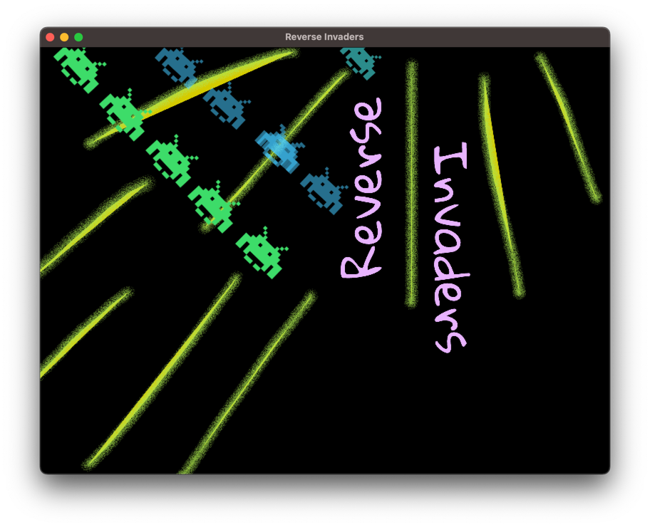
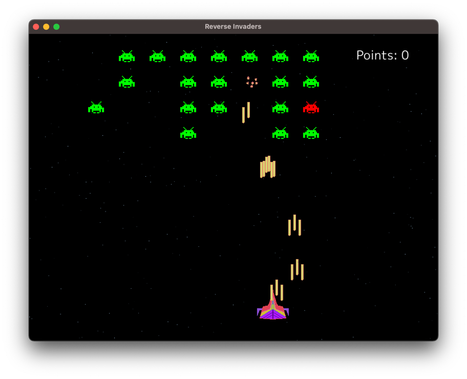

# Reverse Invaders

Simple game made for [Ebitengine Game Jam 2023](https://itch.io/jam/ebitengine-game-jam-2023). The theme is `Reverse`.

You play as one of the aliens in the classic Space Invaders game. The Jam theme is represented as the roles are reversed.

Playing as the enemy is unfair, because you don't control against who you played. There are no levels or increased difficulty, 
from your point of view is random and you are an extra of someone else game(the real hero spaceship).

## Points
You get points when you kill the spaceship. As many points as aliens survived.
When you die, the points will reset.

## Controls
- Arrows/WASD - move alien
- Space - start game/shoot

## ToDo

- [ ] Refactor and make clean all the spaghetti code(specially last commits)
- [ ] Game feature or menu option where the player is reversed in position, having to play with different keys
- [ ] Add power ups for hero spaceship
- [ ] Add lifes to spaceship, to make it more challenging
- [ ] Make transition when the player kills the spaceship more natural, as in game transition
- [ ] Allow controlling multiple aliens at the same time
- [ ] Allow a game option to play in increasing difficulty

## Tools

- To draw sprites: https://www.pixilart.com/
- To draw the initial screen: https://sketch.io/sketchpad/
- To "make" the music: https://drumbit.app/
- To generate explosions: https://sfxr.me/

